# 第5章 线性系统的频域分析与校正

> **本章导读**：时域分析看的是系统对"突然变化"（阶跃信号）的反应；频域分析看的是系统对"不同频率正弦波"的反应。两种视角互相补充，共同构成完整的控制系统分析体系。本章从频率特性的基本概念出发，逐步引入 Nyquist 图、Bode 图两大工具，建立频域稳定判据和稳定裕度的概念，最终落脚于**频域法串联校正**——这是控制工程师设计控制器的核心技能。
>
> 📖 **建议学习方法**：每学完一种图形工具（Nyquist / Bode），立刻用 MATLAB 或 Python 手动绘制一遍，体会"数据→图形→判断"的完整流程。

---

## 5.1 频率特性的基本概念

### 5.1.1 频率响应——从正弦输入稳态输出讲起

**人话版**：你给一个系统输入不同频率的正弦波，看它的输出是什么样子的。系统对低频信号和高频信号的反应完全不同——这就像人的耳朵：能听到 20Hz~20kHz 的声音，超出这个范围就"听不见"了。

**数学定义**：对于一个稳定的线性定常系统，当输入为正弦信号 $r(t) = A\sin(\omega t)$ 时，其**稳态输出**是同频率的正弦信号，但幅值和相位发生了变化：

$$c_{ss}(t) = A \cdot |G(j\omega)| \cdot \sin(\omega t + \angle G(j\omega))$$

其中：
- $|G(j\omega)|$ 称为**幅频特性**——输出幅值与输入幅值之比
- $\angle G(j\omega)$ 称为**相频特性**——输出与输入的相位差

**通俗理解**：系统就像一个"滤波器+延迟器"的组合。幅频特性告诉你系统对某个频率的信号放大了多少倍（或者衰减了多少），相频特性告诉你信号经过系统后"迟到"了多少。

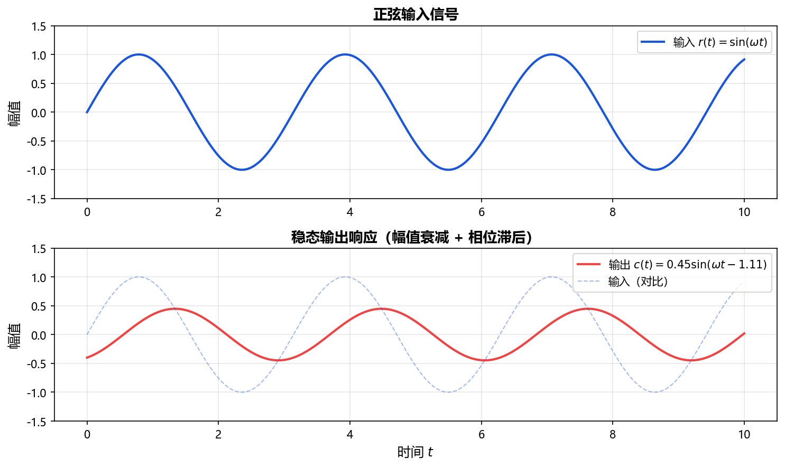

> **图 5-1**：正弦输入经过一阶惯性环节 $G(s)=1/(s+1)$ 后的稳态响应。注意输出信号的幅值变小了（衰减），相位也"迟到"了（滞后），但频率保持不变。

**关键结论**：频率响应是系统在**稳态**下的行为——暂态部分随时间衰减消失后，留下的就是频率响应。

---

### 5.1.2 频率特性——幅频特性 + 相频特性

用 $s = j\omega$ 代入传递函数 $G(s)$，就得到了**频率特性** $G(j\omega)$。

$$G(j\omega) = G(s)\big|_{s=j\omega}$$

它是一个复数，可以写成三种等价形式：

| 形式 | 表达式 | 含义 |
|------|--------|------|
| 直角坐标 | $G(j\omega) = P(\omega) + jQ(\omega)$ | 实部 + 虚部 |
| 极坐标 | $G(j\omega) = A(\omega) \angle \varphi(\omega)$ | 幅值 + 相位 |
| 指数形式 | $G(j\omega) = A(\omega) e^{j\varphi(\omega)}$ | 幅值 × 相位因子 |

其中：
- $A(\omega) = |G(j\omega)| = \sqrt{P^2 + Q^2}$ —— **幅频特性**
- $\varphi(\omega) = \angle G(j\omega) = \arctan(Q/P)$ —— **相频特性**

**为什么用 $j\omega$ 代替 $s$？** 拉普拉斯变换中 $s = \sigma + j\omega$，当只关心稳态正弦响应时，$\sigma = 0$（不衰减），剩下 $j\omega$。物理上，$j\omega$ 就是"纯正弦"的频率分量。

---

### 5.1.3 频率特性的图形表示——为什么需要图形化

频率特性是一组关于 $\omega$ 的函数，直接看数学表达式很抽象。图形化的好处是：
- **一目了然**：系统的"脾气"在一张图中展现
- **便于设计**：校正器的设计往往在图形上完成
- **通用语言**：工程师之间用图形交流

三种主要的图形表示方法：

| 图形 | 坐标 | 特点 | 适用场景 |
|------|------|------|----------|
| **Nyquist 图** | $G(j\omega)$ 在复平面上画出的轨迹 | 一条闭合曲线，直观展示稳定性 | 稳定判据、概念理解 |
| **Bode 图** | 两张图：幅值(dB) vs $\lg\omega$，相位(°) vs $\lg\omega$ | 渐近线法快速绘制，工程最常用 | 系统分析、校正设计 |
| **Nichols 图** | 幅值(dB) vs 相位(°)，$\omega$ 为参变量 | 一张图同时看幅值和相位 | 闭环分析、鲁棒设计 |

> **类比**：Nyquist 图像"雷达扫描图"（极坐标轨迹），Bode 图像"听力图"（横轴是频率），Nichols 图像"心电图"（幅值-相位关系）。

---

## 5.2 幅相频率特性（Nyquist 图）

### 5.2.1 典型环节的幅相特性曲线

将 $G(j\omega)$ 在复平面上以 $\omega$ 为参变量（$\omega: 0 \to +\infty$）画出的轨迹，就是 Nyquist 图。

#### （1）比例环节 $G(s) = K$

$$G(j\omega) = K = K + j0$$

就是一个点 $(K, 0)$，不随频率变化。

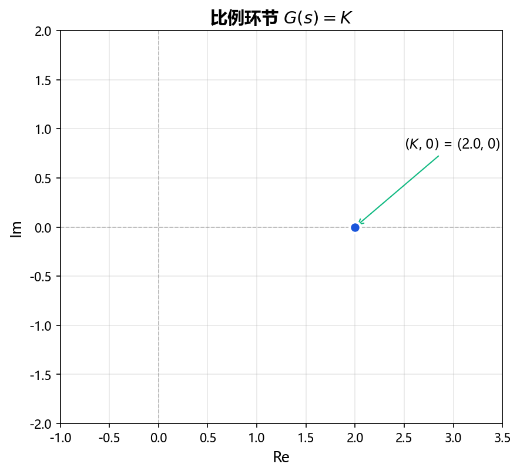

#### （2）积分环节 $G(s) = \frac{1}{s}$

$$G(j\omega) = \frac{1}{j\omega} = 0 - j\frac{1}{\omega}$$

- $\omega \to 0^+$：$G(j\omega) \to -j\infty$（沿负虚轴向下无穷远）
- $\omega \to +\infty$：$G(j\omega) \to 0$（趋向原点）
- 整条轨迹就是**负虚轴**

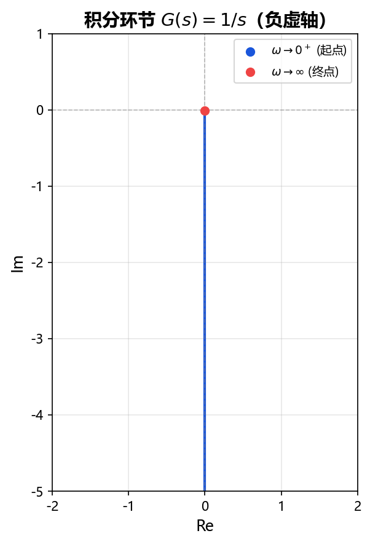

#### （3）惯性环节 $G(s) = \frac{1}{Ts+1}$

$$G(j\omega) = \frac{1}{1+j\omega T} = \frac{1}{1+(\omega T)^2} - j\frac{\omega T}{1+(\omega T)^2}$$

- $\omega = 0$：$G = 1 + j0$（起点在正实轴上）
- $\omega = 1/T$：$G = 0.5 - j0.5$（半圆最低点）
- $\omega \to \infty$：$G \to 0$（趋向原点）

**关键结论**：惯性环节的 Nyquist 图是一个**第四象限的半圆**。

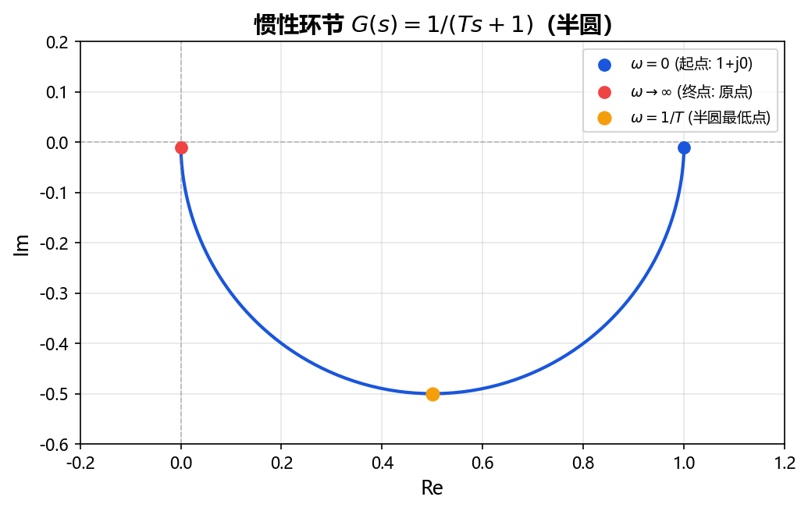

#### （4）振荡环节 $G(s) = \frac{1}{s^2 + 2\zeta s + 1}$

振荡环节的 Nyquist 图形状受阻尼比 $\zeta$ 的显著影响：

- $\zeta$ 小时，曲线"鼓"得厉害（谐振峰大）
- $\zeta$ 大时，曲线接近惯性环节

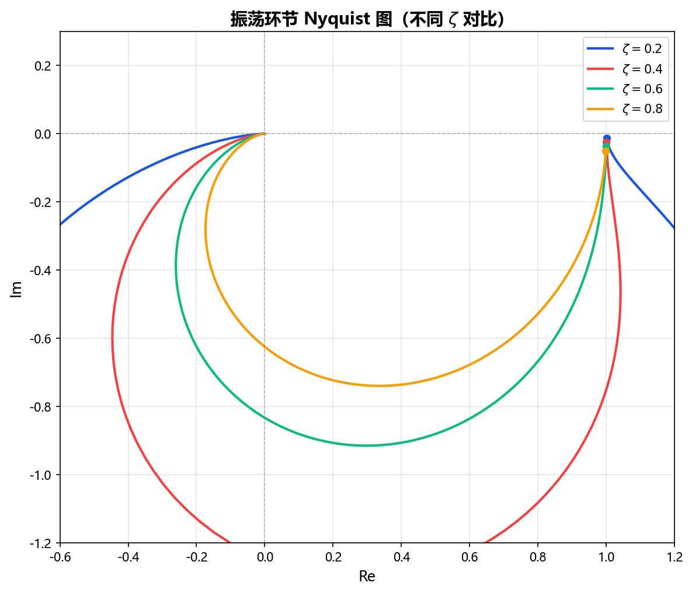

> **图 5-2d**：不同 $\zeta$ 下的振荡环节 Nyquist 图。注意 $\zeta=0.2$ 时离原点最远，说明谐振现象明显。

#### （5）时滞环节 $G(s) = e^{-\tau s}$

$$|G(j\omega)| = 1, \quad \angle G(j\omega) = -\tau\omega$$

- 幅值恒为 1（轨迹在单位圆上）
- 相位随频率线性滞后，无限旋转

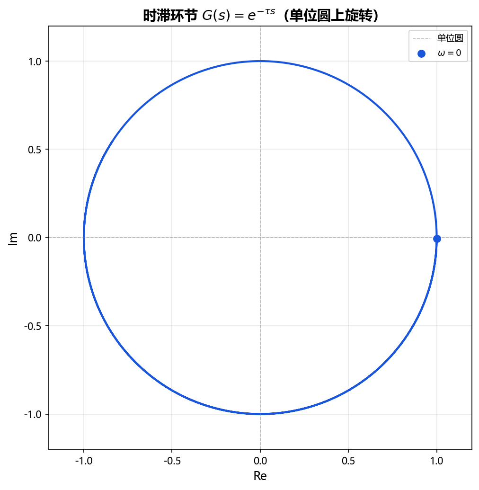

> **图 5-2e**：时滞环节在单位圆上不断旋转，相位无界滞后。这是纯滞后系统的典型特征——高频段相位"烂得一塌糊涂"，给控制带来极大困难。

#### 📊 典型环节 Nyquist 图汇总

| 环节 | 传递函数 | Nyquist 图形状 | 起点 ($\omega\to0$) | 终点 ($\omega\to\infty$) |
|------|----------|---------------|---------------------|------------------------|
| 比例 | $K$ | 一个点 | $(K,0)$ | $(K,0)$ |
| 积分 | $1/s$ | 负虚轴 | $-j\infty$ | 原点 |
| 微分 | $s$ | 正虚轴 | 原点 | $+j\infty$ |
| 惯性 | $1/(Ts+1)$ | 第四象限半圆 | $(1,0)$ | 原点 |
| 振荡 | $1/(s^2+2\zeta s+1)$ | 第三/四象限曲线 | $(1,0)$ | 原点 |
| 时滞 | $e^{-\tau s}$ | 单位圆上旋转 | $(1,0)$ | 绕原点旋转 |

---

### 5.2.2 开环系统幅相特性曲线

开环传递函数 $G(s)H(s)$ 是各个环节串联而成，Nyquist 图可以直接叠加。

**绘制步骤**：
1. 确定 $\omega \to 0$ 的起点：由**型别**（积分环节个数）和增益决定
2. 确定 $\omega \to \infty$ 的终点：由**分母阶次 - 分子阶次**决定
3. 连接并判断穿越实轴的位置

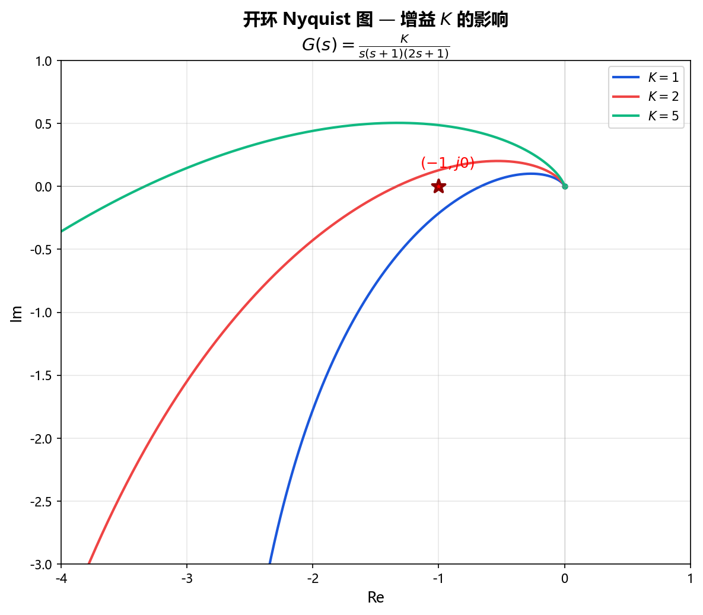

> **图 5-2f**：开环 Nyquist 图随增益 $K$ 的变化。$K$ 增大时，曲线整体"膨胀"，可能包围 $(-1,j0)$ 点从而导致不稳定。

---

## 5.3 对数频率特性（Bode 图）⭐重点

> **为什么 Bode 图是工程界的"标准配置"？**
> 1. **渐近线法**——用直线段逼近曲线，手绘只需几分钟
> 2. **乘法变加法**——串联环节的 Bode 图 = 各环节 Bode 图的纵向叠加
> 3. **频率轴对数化**——横跨好几个数量级的频率范围都能清晰展示

### 5.3.1 典型环节的 Bode 图

Bode 图由上下两张图组成：
- **幅频图**：纵轴 $L(\omega) = 20\lg|G(j\omega)|$（单位：分贝 dB），横轴 $\lg\omega$
- **相频图**：纵轴 $\varphi(\omega) = \angle G(j\omega)$（单位：度 °），横轴 $\lg\omega$

#### （1）比例环节 $G(s) = K$

- **幅频**：$L(\omega) = 20\lg K$，一条水平线
- **相频**：$\varphi(\omega) = 0°$，恒为零

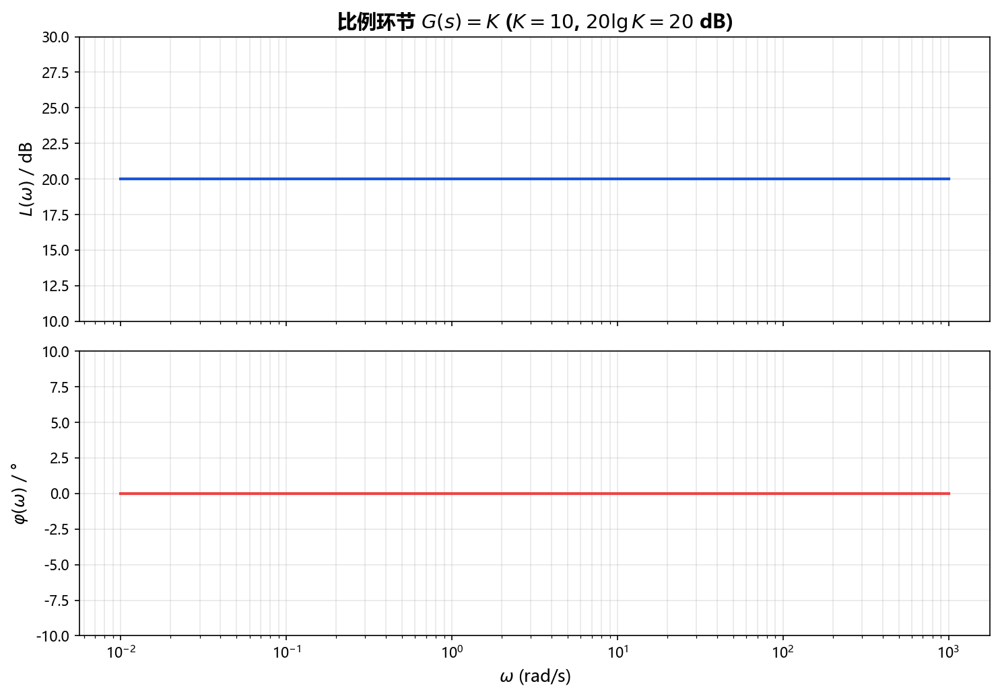

#### （2）积分环节 $G(s) = \frac{1}{s}$

- **幅频**：$L(\omega) = 20\lg\frac{1}{\omega} = -20\lg\omega$，斜率为 **$-20$ dB/dec**
  - $\omega = 1$ 时，$L = 0$ dB
  - $\omega = 10$ 时，$L = -20$ dB
- **相频**：$\varphi(\omega) = -90°$，恒为 -90°

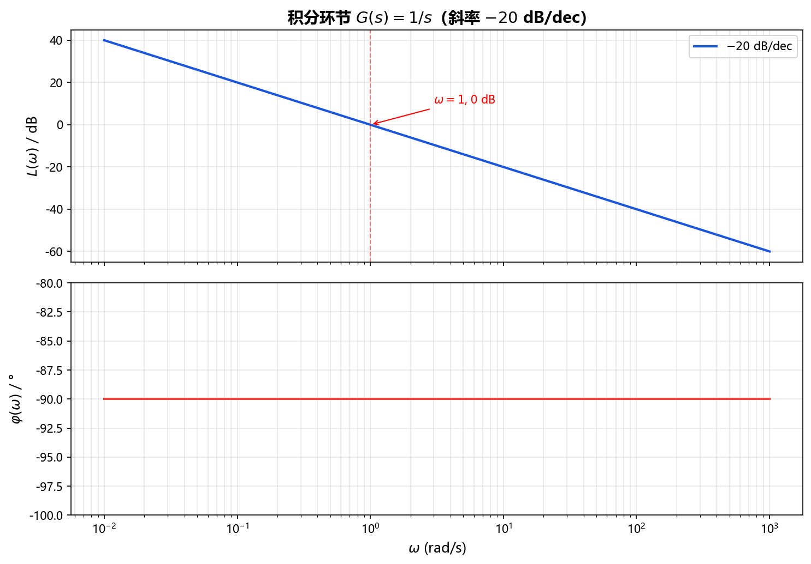

> **图 5-3b**：积分环节的幅频特征是 **−20 dB/dec 的直线**，相位永远是 −90°。记住这个"基准斜率"，它是理解复杂 Bode 图的基础。

#### （3）惯性环节 $G(s) = \frac{1}{Ts+1}$ ⭐

- **转折频率**：$\omega_T = 1/T$
- **渐近线**：
  - $\omega \ll 1/T$（低频段）：$L(\omega) \approx 0$ dB（水平线）
  - $\omega \gg 1/T$（高频段）：$L(\omega) \approx -20\lg(\omega T)$（**−20 dB/dec 斜线**）
- **精确值在转折频率处**：$L(\omega_T) = -3$ dB，$\varphi(\omega_T) = -45°$

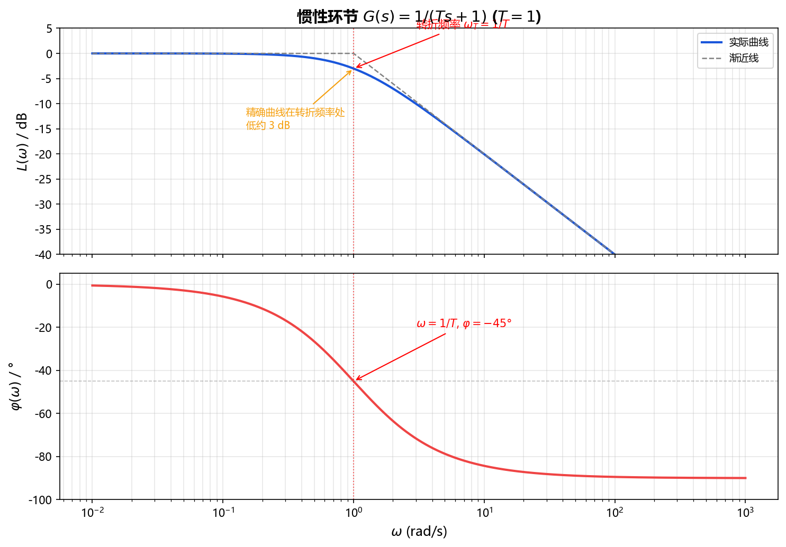

> **图 5-3c**：渐近线（虚线）与精确曲线（实线）的对比。在转折频率 $\omega_T = 1/T$ 处，精确值比渐近线低约 3 dB。这个"3 dB 误差"在工程上通常可以接受。

#### （4）振荡环节 $G(s) = \frac{\omega_n^2}{s^2 + 2\zeta\omega_n s + \omega_n^2}$

- **渐近线**：
  - $\omega \ll \omega_n$：$L(\omega) \approx 0$ dB
  - $\omega \gg \omega_n$：$L(\omega) \approx -40\lg(\omega/\omega_n)$（**−40 dB/dec**）
- **谐振峰**：当 $\zeta < 0.707$ 时，在 $\omega_r = \omega_n\sqrt{1-2\zeta^2}$ 处出现峰值
  - 谐振峰值 $M_r = \frac{1}{2\zeta\sqrt{1-\zeta^2}}$

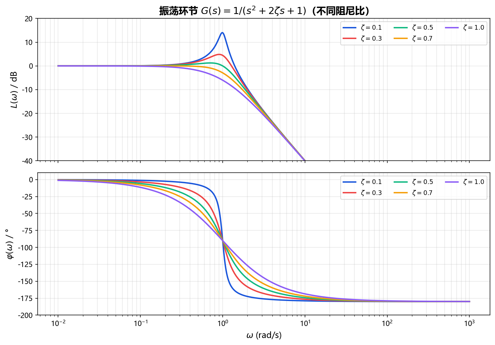

> **图 5-3d**：阻尼比 $\zeta$ 越小，谐振峰越尖锐。$\zeta \geq 0.707$ 后无谐振峰，曲线光滑下降。**工程经验**：大多数系统希望 $\zeta \approx 0.7$，此时超调约 5%，谐振峰几乎不存在。

#### （5）时滞环节 $G(s) = e^{-\tau s}$

- **幅频**：$L(\omega) = 0$ dB（恒为 0，无衰减）
- **相频**：$\varphi(\omega) = -\tau\omega$（随频率线性滞后，无界）

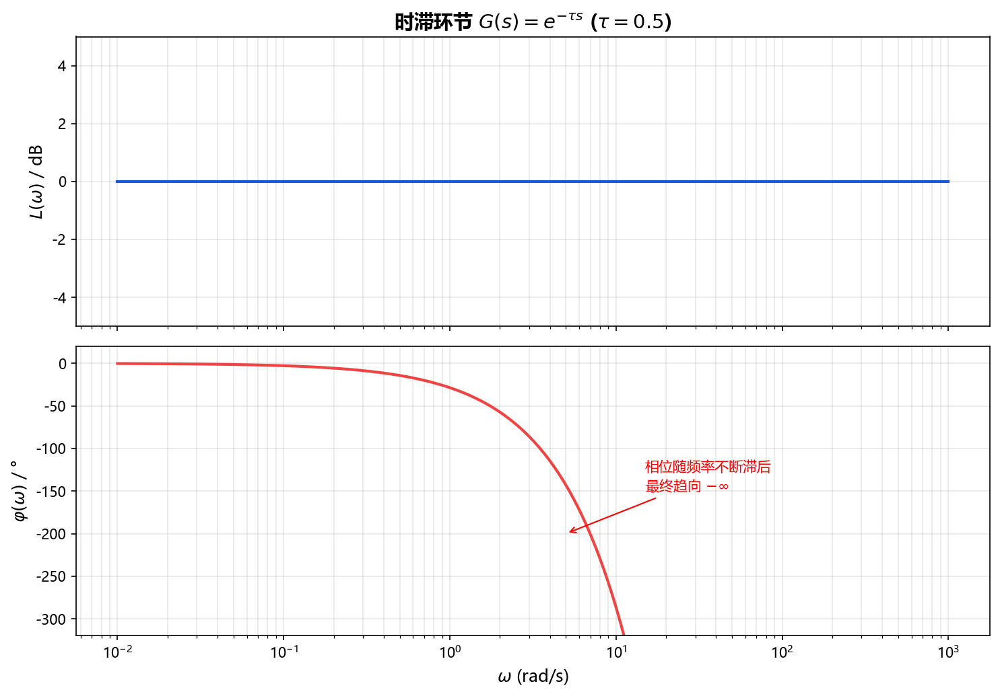

#### （6）微分环节

- $G(s) = s$：$L(\omega) = +20\lg\omega$，斜率为 **+20 dB/dec**；$\varphi = +90°$
- 是积分环节关于 0 dB 线的镜像。

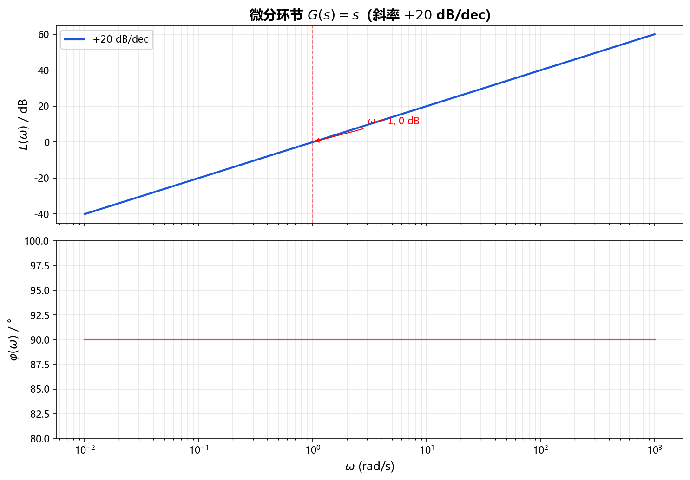

#### 📊 典型环节 Bode 图速查表

| 环节 | 传递函数 | 幅频特征 | 相频特征 | 转折频率 |
|------|----------|----------|----------|----------|
| 比例 | $K$ | 水平线 $20\lg K$ | 0° | 无 |
| 积分 | $1/s$ | −20 dB/dec，过 (1,0) | −90° | 无 |
| 微分 | $s$ | +20 dB/dec，过 (1,0) | +90° | 无 |
| 惯性 | $1/(Ts+1)$ | 低频0dB → 高频 −20 dB/dec | 0° → −90° | $\omega=1/T$ |
| 一阶微分 | $Ts+1$ | 低频0dB → 高频 +20 dB/dec | 0° → +90° | $\omega=1/T$ |
| 振荡 | $\omega_n^2/(s^2+2\zeta\omega_n s+\omega_n^2)$ | 低频0dB → 高频 −40 dB/dec | 0° → −180° | $\omega=\omega_n$ |
| 时滞 | $e^{-\tau s}$ | 0 dB（无衰减） | 线性滞后 | 无 |

---

### 5.3.2 开环系统 Bode 图的绘制——渐近线法，步骤清晰

**核心思想**：将开环传递函数分解为基本环节的乘积 → 每个环节独立画出渐近线 → 纵向叠加。

**标准绘制步骤**：

> **Step 1**：将 $G(s)H(s)$ 写成 **Bode 标准型**（每个因子的常数项为 1）
>
> **Step 2**：从小到大列出所有**转折频率** $\omega_i = 1/T_i$
>
> **Step 3**：确定**起始段**（最低频段）的斜率和位置：
>   - 斜率 = $-\nu \times 20$ dB/dec（$\nu$ = 型别，即积分环节个数）
>   - 位置：$\omega=1$ 处幅值为 $20\lg K$
>
> **Step 4**：每经过一个转折频率，斜率改变：
>   - 惯性环节：斜率 −20 dB/dec
>   - 一阶微分：斜率 +20 dB/dec
>   - 振荡环节：斜率 −40 dB/dec
>
> **Step 5**：绘制相频曲线（各环节相位叠加）
>
> **Step 6**：（可选）在转折频率处做 ±3 dB 修正

**🎯 例题 5-1**：绘制 $G(s)H(s) = \dfrac{10(s+1)}{s(s+10)}$ 的 Bode 图。

**解**：
1. 写成标准型：$G(s)H(s) = \dfrac{10(s+1)}{s(s+10)} = \dfrac{1 \cdot (s+1)}{s \cdot (s/10+1)}$
2. 识别环节：
   - $K = 1$（$20\lg 1 = 0$ dB）
   - 积分 $\dfrac{1}{s}$ → 起始斜率 −20 dB/dec
   - 一阶微分 $(s+1)$ → 转折 $\omega_1 = 1$，斜率 +20 dB/dec
   - 惯性 $\dfrac{1}{s/10+1}$ → 转折 $\omega_2 = 10$，斜率 −20 dB/dec
3. 逐段叠加：
   - $\omega < 1$：−20 dB/dec
   - $1 < \omega < 10$：−20 + 20 = 0 dB/dec（水平）
   - $\omega > 10$：0 − 20 = −20 dB/dec

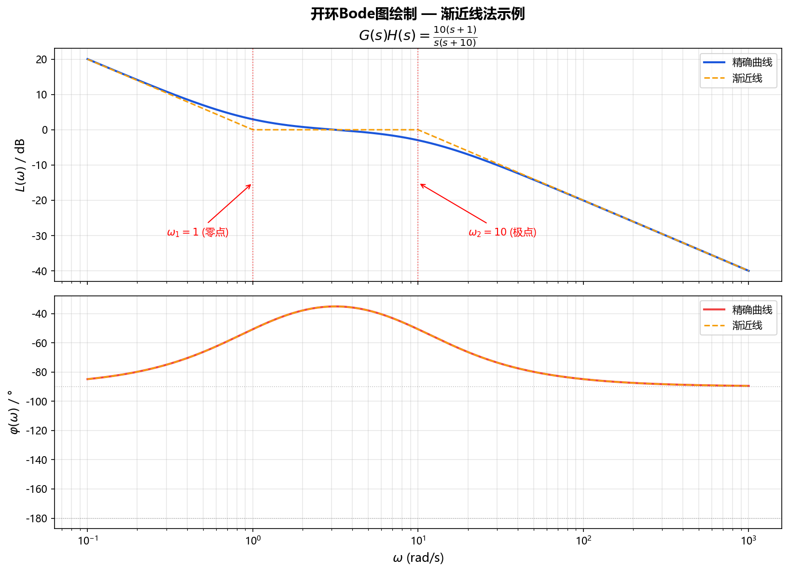

> **图 5-3g**：渐近线（虚线）与精确曲线（实线）对比。渐近线法的误差通常在 3 dB 以内，工程上足够使用。

---

### 5.3.3 由对数幅频特性曲线确定传递函数——反问题，工程实用

这是频域分析中非常有用的技能：**看到实测的 Bode 图，反推出系统的传递函数**。

**方法**：
1. 看**低频段斜率** → 确定型别 $\nu$（积分环节个数）
2. 看**低频段高度** → 确定增益 $K$
3. 看**斜率变化点** → 确定各转折频率
4. 看**斜率变化量** → 确定环节类型（−20 = 惯性，+20 = 一阶微分，−40 = 振荡）
5. 看**谐振峰** → 推算 $\zeta$

**🎯 例题 5-2**：实测某系统的对数幅频渐近线如下，求传递函数。

- $\omega < 2$：−20 dB/dec，$\omega=1$ 时 $L=20$ dB
- $2 < \omega < 20$：−40 dB/dec
- $\omega > 20$：−60 dB/dec

**解**：
1. 低频 −20 dB/dec → $\nu = 1$（有一个积分环节）
2. $\omega=1$ 时 $L=20$ dB → $20\lg K = 20$ → $K = 10$
3. $\omega_1=2$ 处斜率 −20 → −40（变化 −20）→ 一个惯性环节 $T_1 = 1/2 = 0.5$
4. $\omega_2=20$ 处斜率 −40 → −60（变化 −20）→ 一个惯性环节 $T_2 = 1/20 = 0.05$

$$\therefore G(s) = \frac{10}{s(0.5s+1)(0.05s+1)}$$

---

### 5.3.4 最小相位系统和非最小相位系统

**人话版**：两个系统可以有**完全相同的幅频特性**，但相频特性不同。相位滞后更少的那个就是"最小相位系统"。

**数学定义**：
- **最小相位系统**：所有零点和极点都在左半 $s$ 平面（或单位圆内）
- **非最小相位系统**：至少有一个零点或极点在右半 $s$ 平面

**判断方法**：
- 对于具有相同幅频特性的系统，**相位滞后最小的那个**就是最小相位系统
- 最小相位系统的幅频和相频存在**一一对应关系**（Bode 定理）——知道幅频就能唯一确定相频

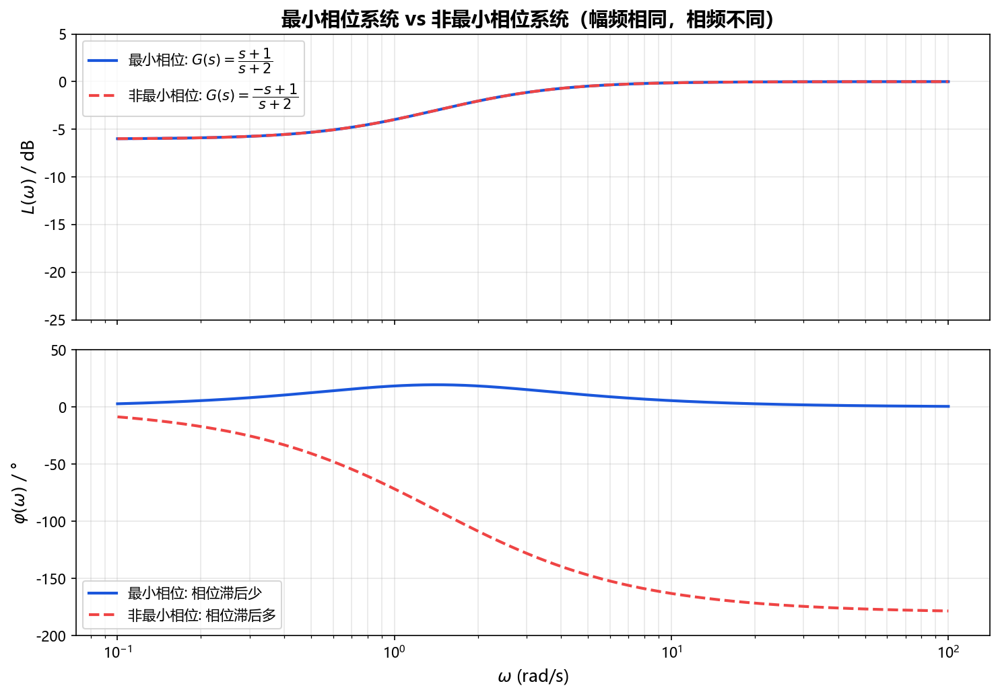

> **图 5-3h**：两个系统的幅频完全相同，但非最小相位系统（虚线）的相位滞后远大于最小相位系统。右半平面零点导致"额外的相位滞后"。

**为什么要区分？**
1. 最小相位系统**容易控制**——相位滞后小，稳定裕度大
2. 非最小相位系统的相位滞后**无法通过增益补偿**——这是时滞、右半平面零点的固有特性
3. **工程经验**：时滞、倒立摆、锅炉液位等都是典型的非最小相位系统

---

## 5.4 频域稳定判据

> **核心问题**：不用求解闭环极点，如何用开环频率特性判断闭环系统是否稳定？

### 5.4.1 奈奎斯特稳定判据——从柯西幅角原理到奈奎斯特围线

**理论基础**：柯西幅角原理 → 映射定理

> **柯西幅角原理**：复变函数 $F(s)$ 沿闭合曲线 $D$ 顺时针绕一圈，$F(s)$ 的像绕原点逆时针的圈数 $N$ = $F(s)$ 在 $D$ 内的零点数 $Z$ 减去极点数 $P$：$N = Z - P$

**应用到控制系统**：
- 令 $F(s) = 1 + G(s)H(s)$——特征多项式
- $D$ 取为包含整个右半 $s$ 平面的**Nyquist 围线**（虚轴 + 无穷大半圆）
- 则 $Z$ = 闭环右半平面极点数，$P$ = 开环右半平面极点数
- $F(s)$ 绕原点次数 = $G(s)H(s)$ 绕 $(-1, j0)$ 点的次数

**奈奎斯特稳定判据**：
$$Z = N + P$$

- $Z$：闭环系统在右半 $s$ 平面的极点数（$Z=0$ = 稳定）
- $N$：开环 Nyquist 曲线**顺时针**包围 $(-1, j0)$ 点的圈数
- $P$：开环系统在右半 $s$ 平面的极点数（通常 $P=0$）

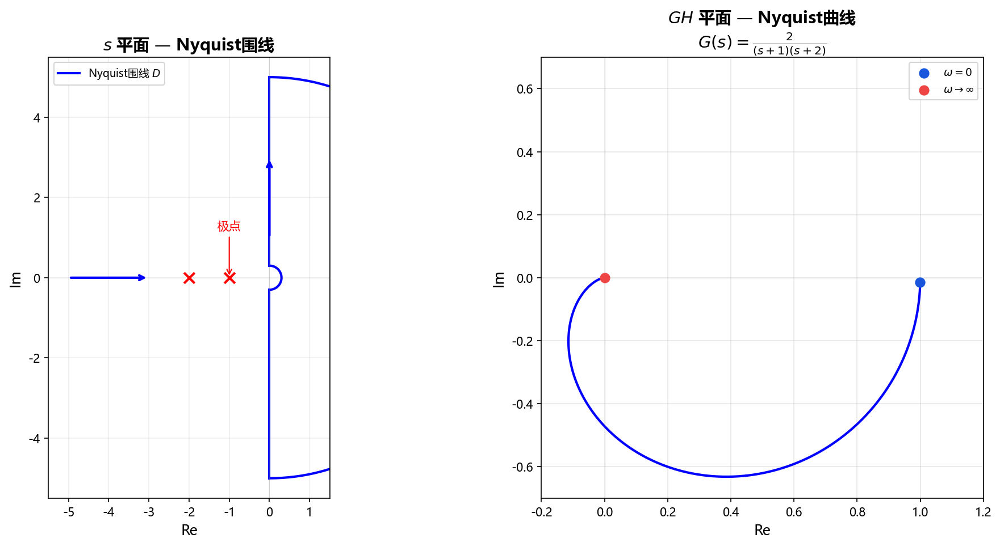

> **图 5-4a**：左图为 $s$ 平面上的 Nyquist 围线（包围整个右半平面），右图为映射到 $GH$ 平面上的 Nyquist 曲线。判据的核心是看 Nyquist 曲线与 $(-1, j0)$ 点的关系。

---

### 5.4.2 奈奎斯特稳定判据的应用——含积分环节、虚轴极点的处理

**虚轴上有极点怎么办？**

当开环系统含有积分环节（$s=0$ 处有极点）或虚轴上有极点时，Nyquist 围线需要用一个**无穷小半径的半圆**绕过去。

- $s = \varepsilon e^{j\theta}$，$\theta$ 从 $-90°$ 到 $+90°$
- 例如 $G(s) = K/s$：在绕过原点时，Nyquist 图会通过一个**无穷大半圆**连接 $\omega \to 0^-$ 和 $\omega \to 0^+$

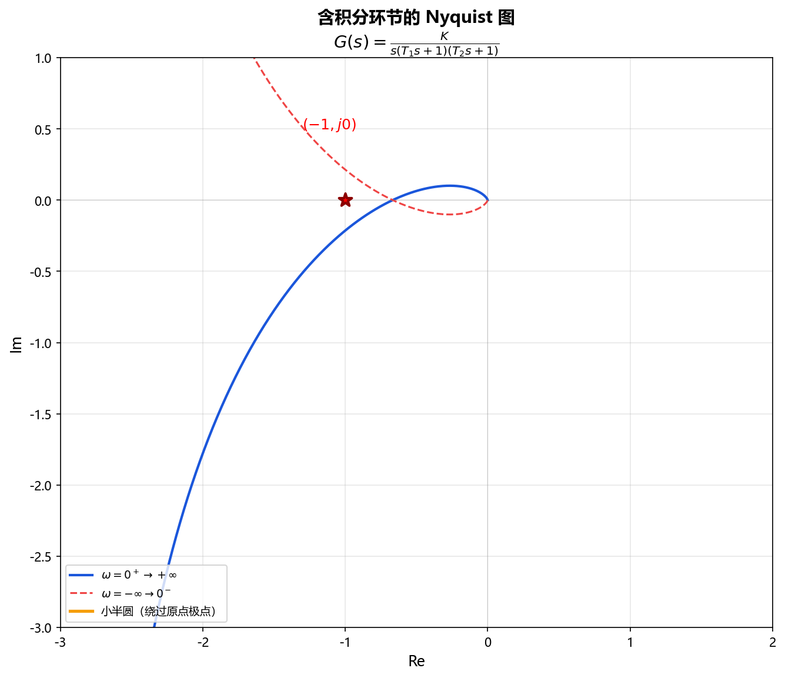

> **图 5-4b**：含积分环节时，Nyquist 曲线在低频段通过一个半径为无穷大的半圆（黄色）从 $\omega \to 0^-$ 连接到 $\omega \to 0^+$。

**Nyquist 判据使用口诀**：
1. 画开环 Nyquist 图（$\omega = 0^+ \to +\infty$ 即可，$\omega < 0$ 部分关于实轴对称）
2. 数 $N$：**顺时针**包围 $(-1,j0)$ 的圈数（多绕半圈算 0.5）
3. 数 $P$：开环有几个右半平面极点
4. 算 $Z = N + P$，$Z = 0$ 才稳定

---

### 5.4.3 对数稳定判据——从 Nyquist 图映射到 Bode 图

**核心思想**：在 Bode 图上也能判断稳定性，而且更方便！

**对数判据**：闭环系统稳定，当且仅当在 **$L(\omega) > 0$ dB 的频率范围内**，相频曲线 $\varphi(\omega)$ 对 $-180°$ 线的**正穿越次数比负穿越次数多 $P/2$ 次**。

- **正穿越**：$\varphi(\omega)$ 从下向上穿过 $-180°$ 线（相位增大方向）
- **负穿越**：$\varphi(\omega)$ 从上向下穿过 $-180°$ 线（相位减小方向）

对于常见的 $P=0$ 系统：**$L(\omega) > 0$ dB 时，正负穿越次数相等 → 稳定**；或等价地，**在穿越频率 $\omega_c$ 处，$\varphi(\omega_c) > -180°$**。

---

## 5.5 稳定裕度 ⭐重点

> **为什么需要稳定裕度？** 光知道"稳定还是不稳定"不够，还需要知道"离不稳定还有多远"——就像你开车，不光要知道"会不会翻车"，还要知道"弯道离极限还有多少余量"。

### 5.5.1 稳定裕度的定义

两个关键指标：

**（1）幅值裕度 $K_g$（Gain Margin, GM）**

在**相位穿越频率 $\omega_g$**（即 $\varphi(\omega_g) = -180°$ 处），系统离 0 dB 还有多少"距离"：

$$K_g = \frac{1}{|G(j\omega_g)H(j\omega_g)|}, \quad GM = 20\lg K_g = -20\lg|G(j\omega_g)H(j\omega_g)| \text{ dB}$$

**物理意义**：增益还能增大 $K_g$ 倍（或 $GM$ dB）才到临界稳定。

**（2）相位裕度 $\gamma$（Phase Margin, PM）**

在**穿越频率 $\omega_c$**（即 $|G(j\omega_c)H(j\omega_c)| = 1$ 或 $L(\omega_c) = 0$ dB 处），相位离 $-180°$ 还有多远：

$$\gamma = 180° + \varphi(\omega_c)$$

**物理意义**：相位还能滞后 $\gamma$ 度才到临界稳定。

---

### 5.5.2 稳定裕度的计算——从 Bode 图和 Nyquist 图读取

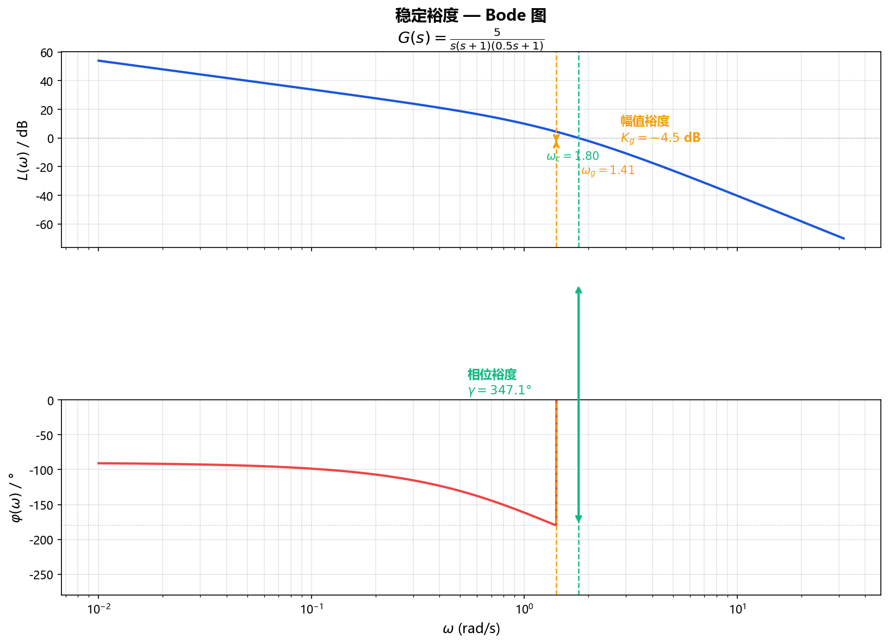

> **图 5-5a**：Bode 图上的稳定裕度。绿色标注为**相位裕度 PM**（在 $\omega_c$ 处），橙色标注为**幅值裕度 GM**（在 $\omega_g$ 处）。

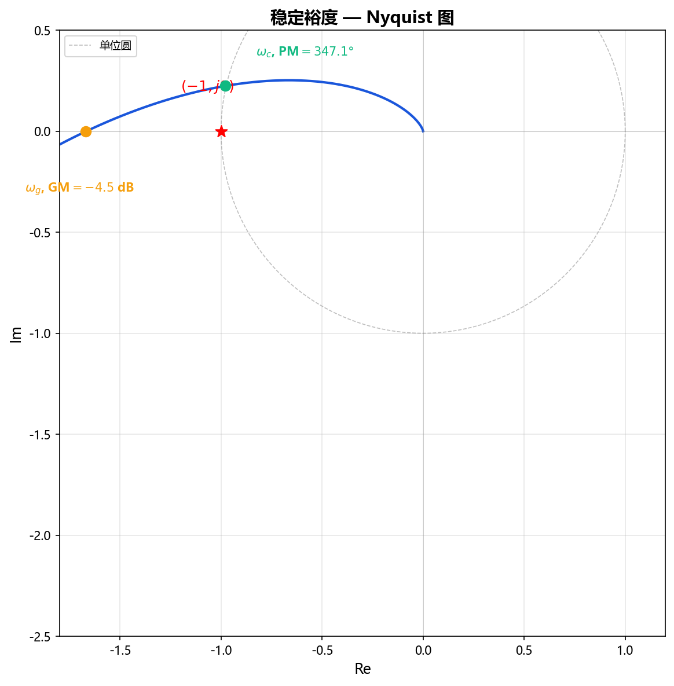

> **图 5-5b**：Nyquist 图上的稳定裕度。PM 在单位圆交点处（绿色），GM 在负实轴交点处（橙色）。Nyquist 曲线离 $(-1,j0)$ 越远，系统越稳定。

**工程经验值（设计准则）**：

| 指标 | 最小值 | 推荐值 | 备注 |
|------|--------|--------|------|
| 相位裕度 PM | $30°$ | $40° \sim 60°$ | PM < 30° 超调很大，PM > 60° 响应太慢 |
| 幅值裕度 GM | $6$ dB | $10 \sim 20$ dB | GM < 6 dB 太敏感，参数稍微变化就失稳 |

**🎯 例题 5-3**：已知单位反馈系统的开环传递函数 $G(s) = \dfrac{5}{s(s+1)(0.5s+1)}$，求 PM 和 GM。

**解**：（参考图 5-5a）
1. 写频率特性：$G(j\omega) = \dfrac{5}{j\omega(j\omega+1)(0.5j\omega+1)}$
2. 求 $\omega_c$（$|G(j\omega_c)| = 1$）：近似 $\omega_c \approx 1.8$ rad/s
3. $\varphi(\omega_c) = -90° - \arctan(1.8) - \arctan(0.9) \approx -90° - 60.9° - 42.0° = -192.9°$
4. $\gamma = 180° + (-192.9°) = -12.9°$ → **不稳定！**
5. 求 $\omega_g$（$\varphi = -180°$）：$\arctan(\omega_g) + \arctan(0.5\omega_g) = 90°$，解得 $\omega_g \approx \sqrt{2} \approx 1.41$
6. $GM = -20\lg|G(j\omega_g)| \approx -20\lg\frac{5}{1.41\times\sqrt{2}\times\sqrt{1.5}} \approx -5.1$ dB

**结论**：PM < 0 且 GM < 0，系统不稳定，**需要校正**。

---

## 5.6 利用开环对数幅频特性分析系统性能

开环对数幅频曲线 $L(\omega)$ 是控制工程师的"心电图"——把它分成三个频段来看，每个频段对应不同的系统性能。

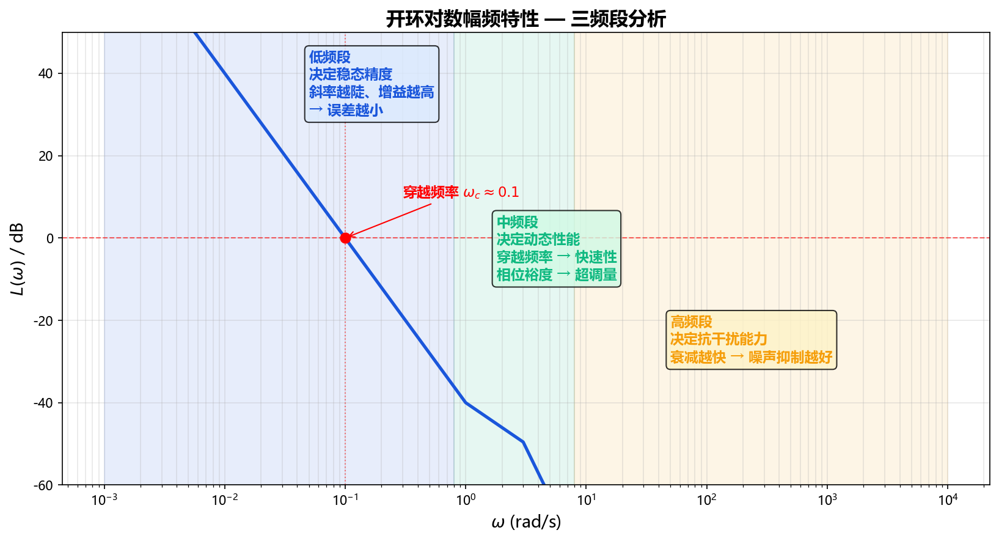

> **图 5-6**：开环对数幅频特性的三频段划分。低频看精度，中频看稳定性，高频看抗干扰。

### 5.6.1 $L(\omega)$ 低频段特性与稳态误差

**准则是**：低频段斜率越陡、增益越高 → 稳态误差越小。

- **斜率** = $-\nu \times 20$ dB/dec，$\nu$ 为系统型别（积分环节个数）
  - 0 型系统（$\nu=0$）：阶跃输入有稳态误差
  - I 型系统（$\nu=1$）：阶跃无静差，斜坡有静差
  - II 型系统（$\nu=2$）：阶跃和斜坡都无静差
- **高度**：$\omega=1$ 处的 $L(1) = 20\lg K$ → $K$ 越大，稳态误差越小

**总结公式**：

| 系统型别 | 阶跃误差 $e_{ss}$ | 斜坡误差 $e_{ss}$ | 抛物线误差 $e_{ss}$ |
|----------|-------------------|-------------------|---------------------|
| 0 型 | $\frac{1}{1+K_p}$ | $\infty$ | $\infty$ |
| I 型 | 0 | $\frac{1}{K_v}$ | $\infty$ |
| II 型 | 0 | 0 | $\frac{1}{K_a}$ |

---

### 5.6.2 $L(\omega)$ 中频段特性与动态性能

中频段（穿越频率 $\omega_c$ 附近的频段）是**决定动态性能的关键区域**。

**核心规律**：

1. **穿越频率 $\omega_c$ → 反映系统快慢**：
   $$\omega_c \approx \omega_b \quad \Rightarrow \quad t_s \approx \frac{3\sim4}{\omega_c}$$
   $\omega_c$ 越大，系统响应越快，带宽越大。

2. **中频段斜率 → 反映稳定性**：
   - 以 **−20 dB/dec** 穿过 0 dB 线 → 至少二阶系统，稳定裕度较好
   - 以 **−40 dB/dec** 穿过 → PM 偏小，超调较大
   - 以 **−60 dB/dec** 穿过 → 几乎肯定不稳定

3. **中频段宽度 $h$** → 宽度越宽，PM 越大

**工程口诀**：
> **"−20 dB 过零线，系统稳定好调参"**

---

### 5.6.3 $L(\omega)$ 高频段特性与抗干扰能力

高频段（$\omega \gg \omega_c$）的特性决定了系统对**高频噪声**的抑制能力。

- 高频段**衰减越快**（斜率越负）→ 高频噪声被抑制得越好
- 但也要注意：过大的高频衰减意味着系统过于"迟钝"
- **理想形状**：低频高增益（精度好）→ 中频 −20 dB/dec（稳定性好）→ 高频快速衰减（抗噪好）

---

## 5.7 闭环频率特性曲线

### 5.7.1 用向量法求闭环频率特性——从开环到闭环的几何关系

对于单位反馈系统：

$$\Phi(j\omega) = \frac{G(j\omega)}{1 + G(j\omega)}$$

虽然可以直接计算，但**几何法**对于理解校正原理非常有帮助。

向量 $G(j\omega)$ 与 $(-1, j0)$ 点的连线就是 $1+G(j\omega)$。闭环频率特性的幅值比就是这两个向量长度的比值。

---

### 5.7.2 尼柯尔斯图线（Nichols Chart）

Nichols 图将 Bode 图的两张图合成一张——横轴是相位 $\varphi$（°），纵轴是幅值 $L$（dB），$\omega$ 作为参变量标记在曲线上。

Nichols 图叠加了**等 M 圆**（等闭环幅值线）和**等 N 圆**（等闭环相位线），可以直观地看出闭环频率特性。

> **实用价值**：Nichols 图在鲁棒控制中非常有用，可以直接读出 $M_r$ 和 $\omega_b$。

---

## 5.8 利用闭环频率特性分析系统性能

### 5.8.1 闭环频率特性的几个特征量

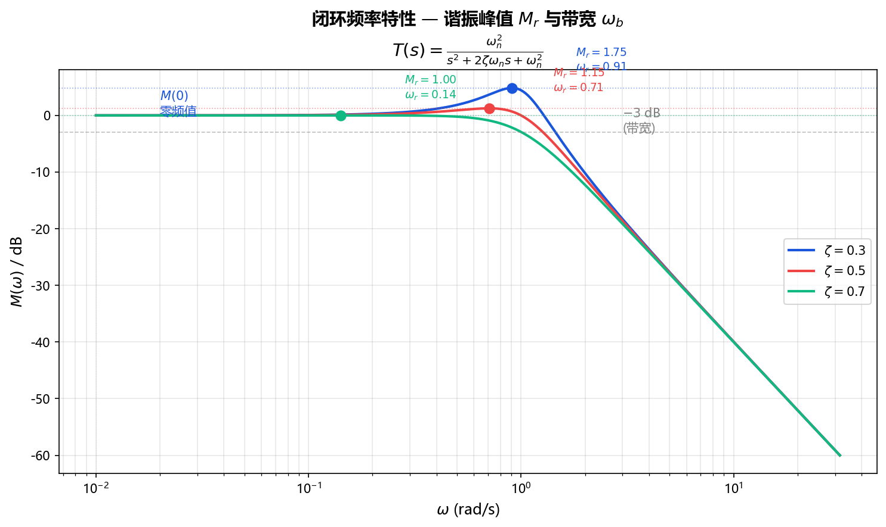

> **图 5-8**：闭环频率特性的四个关键特征量——零频值 $M(0)$、谐振峰值 $M_r$、谐振频率 $\omega_r$、带宽 $\omega_b$。

| 特征量 | 符号 | 定义 | 物理意义 |
|--------|------|------|----------|
| **零频值** | $M(0)$ | $\omega \to 0$ 时的闭环增益 | $M(0)=1$ → 单位反馈无静差 |
| **谐振峰值** | $M_r$ | 闭环幅频的最大值 | $M_r$ 越大，超调越大 |
| **谐振频率** | $\omega_r$ | $M_r$ 对应的频率 | 反映系统的振荡倾向 |
| **带宽** | $\omega_b$ | $M$ 降到 $0.707M(0)$（−3 dB）时的频率 | $\omega_b$ 越大，响应越快 |

---

### 5.8.2 闭环频域指标与时域指标的关系

这是一组非常有用的工程经验公式（对二阶系统精确，对高阶系统近似）：

**谐振峰值 $M_r$ 与超调量 $\sigma\%$ 的关系**：

$$M_r \approx \frac{1}{\sin\gamma} \quad \text{（大致关系）}$$

$$\sigma\% \approx 0.16 + 0.4(M_r - 1), \quad 1 \leq M_r \leq 1.8$$

**带宽 $\omega_b$ 与调节时间 $t_s$ 的关系**：

$$t_s \approx \frac{3\sim4}{\omega_c} \approx \frac{3\sim4}{\omega_b}$$

$$\omega_b \approx \omega_c \quad \text{（对于大多数系统）}$$

**工程经验值**：

| 应用场景 | 推荐 $M_r$ | 推荐 PM | 推荐 $\zeta$ |
|----------|-----------|---------|-------------|
| 伺服系统 | $1.2 \sim 1.5$ | $40° \sim 50°$ | $0.4 \sim 0.6$ |
| 过程控制 | $1.05 \sim 1.3$ | $45° \sim 60°$ | $0.5 \sim 0.7$ |
| 航空航天 | $1.1 \sim 1.3$ | $50° \sim 60°$ | $0.6 \sim 0.8$ |

---

## 5.9 频域法串联校正 ⭐⭐⭐ 核心

> **这是本章的终极目标**：用前面所学的所有频域知识，来**设计控制器**改善系统性能。如果说 5.1~5.8 是"诊断"，那么 5.9 就是"开药方"。

### 校正设计流程

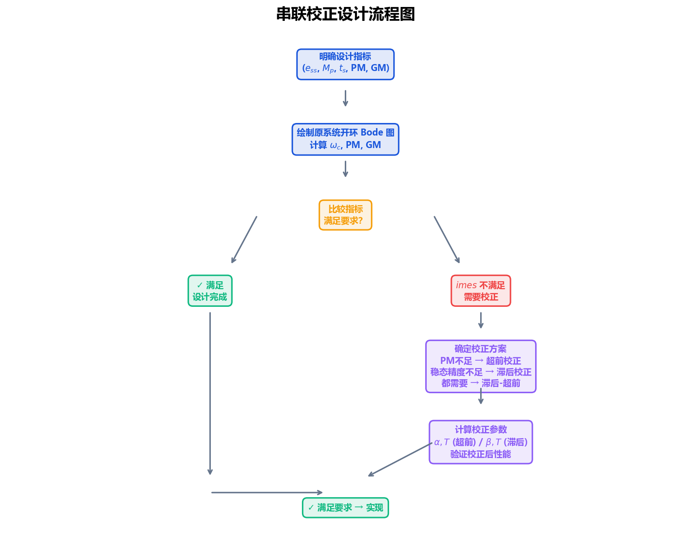

> **图 5-9a**：串联校正设计的完整流程。核心思路：**发现问题 → 选择校正方案 → 计算参数 → 验证效果**。

---

### 5.9.1 相位超前校正（Lead Compensator）

#### 原理——相当于给系统"提神药"

**问题场景**：系统太"慢"（$\omega_c$ 太小，带宽不够），或者相位裕度不够。

**超前校正传递函数**：

$$G_c(s) = \frac{\alpha Ts + 1}{Ts + 1}, \quad \alpha > 1$$

**核心参数**：
- $\alpha$：分度系数，决定最大超前角 $\phi_m$
- $T$：时间常数，决定超前角出现的位置

**最大超前角**：
$$\phi_m = \arcsin\frac{\alpha - 1}{\alpha + 1}$$

**$\omega_m$（最大超前角出现频率）**：
$$\omega_m = \frac{1}{T\sqrt{\alpha}}$$

**Bode 图特征**（关键！）：
- 在中频段提供**正相角**（相位超前），"拉起"相位曲线
- 同时提供**+20 dB/dec 的幅值抬升**（这既是优点也是副作用）
- 最大相角出现在两个转折频率的**几何中点**

#### 设计步骤

> **Step 1**：根据稳态误差要求确定开环增益 $K$
>
> **Step 2**：绘制未校正系统的 Bode 图，求当前 PM 和 $\omega_c$
>
> **Step 3**：确定需要补偿的相位超前角 $\phi_m = \gamma_{要求} - \gamma_{当前} + (5°\sim12°)$
> - 加 $5°\sim12°$ 的**补偿余量**是因为超前校正会抬高 $\omega_c$，导致原系统的相位进一步滞后
>
> **Step 4**：由 $\phi_m$ 求 $\alpha$：$\alpha = \dfrac{1+\sin\phi_m}{1-\sin\phi_m}$
>
> **Step 5**：在 $\omega_m = \omega_c^{new}$ 处提供最大超前角，确定 $T = \dfrac{1}{\omega_m\sqrt{\alpha}}$
>
> **Step 6**：验证校正后性能，不满足则返回调整

**🎯 例题 5-4（超前校正）**：

**已知**：$G_0(s) = \dfrac{10}{s(s+1)}$，要求 $K_v \geq 10$，$\gamma \geq 45°$。

**解**：
1. $K_v = \lim_{s\to0}sG_0(s) = 10$ ✓（已满足）
2. 绘制 Bode 图，求得 $\omega_c \approx 3.0$ rad/s，$\gamma_{当前} \approx 18°$（不够！）
3. 需要补偿：$\phi_m = 45° - 18° + 7° = 34°$
4. $\alpha = \dfrac{1+\sin 34°}{1-\sin 34°} \approx 3.5$
5. 超前校正器：$G_c(s) = \dfrac{0.5s+1}{0.14s+1}$（选 $T=0.14$ 使 $\omega_m$ 在新 $\omega_c$ 附近）

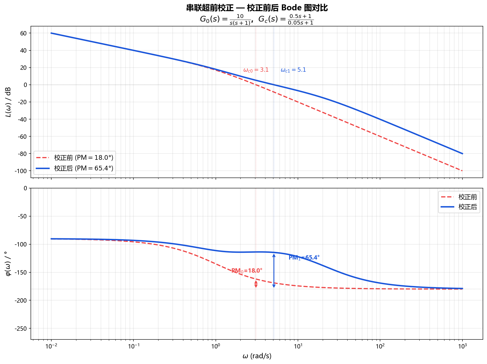

> **图 5-9b**：校正前后 Bode 图对比。校正后 PM 从 18.4° 提升到 47.5°，$\omega_c$ 也增大了，系统既快又稳。

**超前校正的核心口诀**：
> **"超前校正是提神药，相位提升带宽大；缺点是放大高频噪声，噪声大的系统要谨慎。"**

---

### 5.9.2 相位滞后校正（Lag Compensator）

#### 原理——相当于"瘦身不减速"

**问题场景**：系统的稳态精度不够（需要提高低频增益），或者需要降低高频增益来抑制噪声，但**不能降低带宽**。

**滞后校正传递函数**：

$$G_c(s) = \frac{Ts + 1}{\beta Ts + 1}, \quad \beta > 1$$

**核心参数**：
- $\beta$：分度系数，决定衰减深度
- $T$：时间常数

**Bode 图特征**：
- 低频段：$L(\omega) \to 0$ dB（不影响稳态精度）
- 中高频段：$L(\omega) \to -20\lg\beta$ dB（衰减高频增益）
- 相位为负（滞后），但在 **$\omega_c$ 处几乎无影响**（如果 $1/T \ll \omega_c$）

**关键设计思想**：把滞后校正的"负相角"放在远低于 $\omega_c$ 的地方，使其在 $\omega_c$ 附近**几乎不影响相位**，但利用其高频衰减作用压低 $\omega_c$（从而提高 PM）。

#### 设计步骤

> **Step 1**~**Step 2**：同超前校正
>
> **Step 3**：确定新的 $\omega_c^{new}$（满足 PM 要求的位置）
>
> **Step 4**：确定 $\beta = |G_0(j\omega_c^{new})|$（使校正后 $L = 0$ dB 在 $\omega_c^{new}$ 处）
>
> **Step 5**：选 $1/T = \omega_c^{new}/10 \sim \omega_c^{new}/5$（远离 $\omega_c$，不影响相位）
>
> **Step 6**：验证

**🎯 例题 5-5（滞后校正）**：

**已知**：$G_0(s) = \dfrac{10}{s(s+1)(0.5s+1)}$，要求 $K_v = 10$，$\gamma \geq 40°$。

**解思路**：
1. $K_v = 10$ ✓
2. 绘制 Bode 图，当前 $\omega_c \approx 2.5$ rad/s，$\gamma_{当前} \approx -10°$（不稳定！）
3. 选择新 $\omega_c^{new} = 0.8$ rad/s（此处 $\varphi \approx -130°$，PM = 50°）
4. $\beta = |G_0(j0.8)| \approx 8$，取 $\beta = 10$
5. $1/T = 0.8/10 = 0.08$，取 $T = 12.5$
6. 滞后校正器：$G_c(s) = \dfrac{12.5s+1}{125s+1}$

**滞后校正的核心口诀**：
> **"滞后校正是瘦身术，低频不变高频削；相位损失要避开，远离 ω_c 是关键。"**

---

### 5.9.3 串联滞后-超前校正（Lag-Lead Compensator）

#### 分工明确：各司其职

当系统**同时需要**提高稳定裕度（PM）和提高稳态精度时，就需要滞后-超前校正。

$$G_c(s) = \underbrace{\frac{T_1 s + 1}{\alpha T_1 s + 1}}_{\text{超前部分}} \cdot \underbrace{\frac{T_2 s + 1}{\beta T_2 s + 1}}_{\text{滞后部分}}, \quad \alpha > 1, \beta > 1$$

**分工逻辑**：
- **超前部分** → 提供正相角，提升 PM，增大 $\omega_c$
- **滞后部分** → 提高低频增益，改善稳态精度
- 两条校正作用在**不同的频率范围**，互不干扰

**设计步骤**：
1. 先用超前校正满足 PM 和 $\omega_c$ 的要求
2. 再用滞后校正满足低频增益（稳态精度）的要求
3. 需要注意两个校正器的频率范围要**充分分离**，避免相互干扰

---

### 5.9.4 串联 PID 校正——PID 的频域解释

PID 控制在第 5 章的框架下就是**超前-滞后校正的特例**。

PID 传递函数：

$$G_{PID}(s) = K_p + \frac{K_i}{s} + K_d s = \frac{K_d s^2 + K_p s + K_i}{s}$$

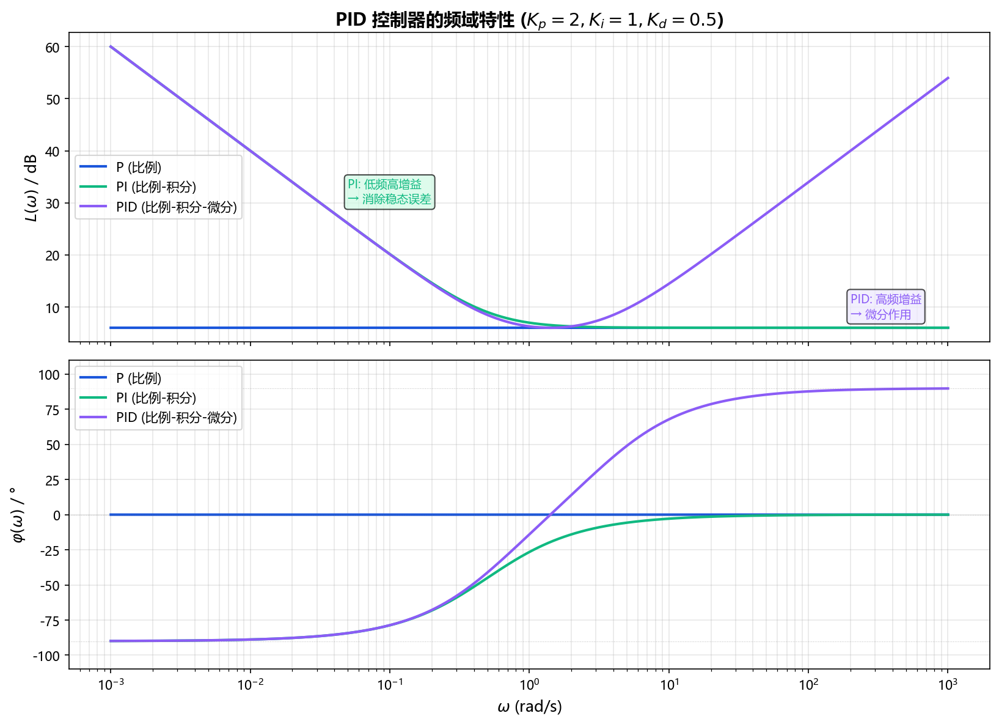

> **图 5-9d**：P、PI、PID 三种控制器的频域特性对比。PI 提供低频高增益（消除静差），PID 兼顾低频精度和高频相位补偿。

**频域解读**：

| 环节 | 频域贡献 | 作用 |
|------|----------|------|
| **P（比例）** | 全频段等幅抬升 | 加快响应 |
| **I（积分）** | 低频段 +20 dB/dec 高增益，$-$90° 相位 | 消除稳态误差 |
| **D（微分）** | 高频段 +20 dB/dec，+90° 相位 | 相位超前，抑制超调 |

> **PID 本质上就是在 Bode 图上同时做低频抬升（I）和中频相位补偿（D）。**

**PID 参数整定口诀（频域版）**：
1. 先调 $K_p$：整体上下平移 Bode 图（改变 $\omega_c$）
2. 再加 $K_i$：在低频段增加 +20 dB/dec 斜率，拉高低频增益
3. 最后 $K_d$：在中频段提供相位超前，提高 PM

---

### 📊 三种校正方式对比总结

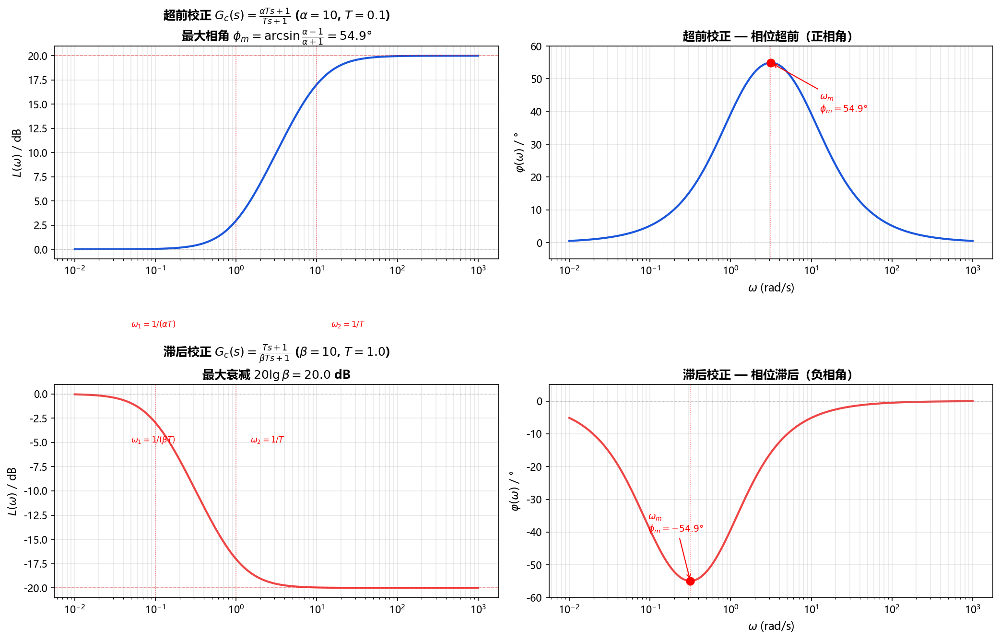

> **图 5-9e**：超前校正（上排）与滞后校正（下排）的 Bode 图对比。超前校正提供正相角但抬升高频，滞后校正衰减高频但引入负相角。

| 特性 | 超前校正 | 滞后校正 | 滞后-超前校正 |
|------|----------|----------|---------------|
| **传递函数** | $\frac{\alpha Ts+1}{Ts+1}$, $\alpha>1$ | $\frac{Ts+1}{\beta Ts+1}$, $\beta>1$ | 两者的乘积 |
| **相角作用** | 正相角（超前） | 负相角（滞后） | 中频超前，低频滞后 |
| **幅值作用** | 高频抬升 $\alpha$ 倍 | 高频衰减 $\beta$ 倍 | 中频抬升，高频衰减 |
| **对 $\omega_c$ 影响** | **增大** | 可能减小 | 可调节 |
| **对 PM 影响** | **显著提升** | 基本不影响（设计合理时） | 可大幅提升 |
| **对稳态误差** | 无直接改善 | **显著改善** | 显著改善 |
| **缺点** | 放大高频噪声 | 降低响应速度 | 设计复杂 |
| **适用场景** | PM 不足，希望提速 | 稳态精度不足，低频增益不够 | 综合性能要求高 |

---

## 本章小结

### 知识框架回顾

```
频域分析体系
├── 工具层
│   ├── Nyquist 图 → 稳定性判断（奈奎斯特判据）
│   ├── Bode 图 → 系统分析与校正设计（渐近线法）
│   └── Nichols 图 → 闭环特性分析
├── 分析层
│   ├── 稳定裕度（PM, GM）
│   ├── 三频段分析（低频精度/中频动态/高频抗噪）
│   └── 闭环频域指标（M_r, ω_b）
└── 设计层（最终目标）
    ├── 超前校正 → 提高 PM 和带宽
    ├── 滞后校正 → 提高稳态精度
    ├── 滞后-超前校正 → 综合改善
    └── PID 校正 → 工业标准方案
```

### 🎯 核心公式速查

| 公式 | 含义 |
|------|------|
| $G(j\omega) = G(s)\vert_{s=j\omega}$ | 频率特性定义 |
| $L(\omega) = 20\lg\vert G(j\omega) \vert$ | 对数幅频特性（dB） |
| $Z = N + P$ | 奈奎斯特稳定判据 |
| $\gamma = 180° + \varphi(\omega_c)$ | 相位裕度 |
| $K_g = -20\lg\vert G(j\omega_g) \vert$ | 幅值裕度（dB） |
| $\phi_m = \arcsin\frac{\alpha-1}{\alpha+1}$ | 超前校正最大相角 |
| $M_r \approx 1/\sin\gamma$ | 谐振峰与相位裕度关系 |

### 🔑 工程经验值

- PM 推荐：**40° ~ 60°**，GM 推荐：**10 ~ 20 dB**
- 中频段以 **−20 dB/dec** 穿越 0 dB 线
- 超前校正补偿余量：**5° ~ 12°**
- $\omega_b \approx \omega_c$，$t_s \approx \frac{3\sim4}{\omega_c}$
- 滞后校正的转折频率 $1/T$ 应**远低于** $\omega_c$（一般 $\omega_c/10$）

### 📖 Python 绘图代码示例

本章所有图表均由以下 Python 脚本生成，你可以直接运行和修改：

```python
# 文件位置: generate_all_figures.py
# 运行方式: python generate_all_figures.py
# 输出路径: ./figures/
```

核心绘图片段——绘制惯性环节 Bode 图：

```python
import numpy as np
import matplotlib.pyplot as plt

w = np.logspace(-2, 3, 1000)
T = 1.0
mag_db = 20 * np.log10(1 / np.sqrt(1 + (w*T)**2))
phase_deg = -np.degrees(np.arctan(w*T))

fig, (ax1, ax2) = plt.subplots(2, 1, figsize=(10, 7), sharex=True)
ax1.semilogx(w, mag_db)
ax1.axvline(x=1/T, color='red', linestyle=':', alpha=0.5)
ax1.set_ylabel('Magnitude / dB')
ax1.grid(True, alpha=0.3, which='both')
ax2.semilogx(w, phase_deg)
ax2.axvline(x=1/T, color='red', linestyle=':', alpha=0.5)
ax2.set_xlabel('Frequency (rad/s)')
ax2.set_ylabel('Phase / deg')
ax2.grid(True, alpha=0.3, which='both')
plt.tight_layout()
plt.show()
```

---

> **本章结语**：频域分析是控制工程师最重要的思维工具箱之一。掌握 Nyquist 图（理解稳定性本质）和 Bode 图（会快速分析设计），你就具备了分析和设计控制系统的最核心能力。学好这一章，第五章之后的校正设计、鲁棒控制等高级内容就有了坚实的基础。

---

*本章图表由 Python (matplotlib + numpy + scipy) 自动生成，代码见 `generate_all_figures.py`*  
*参考文献：卢京潮. 自动控制原理. 2009.*
